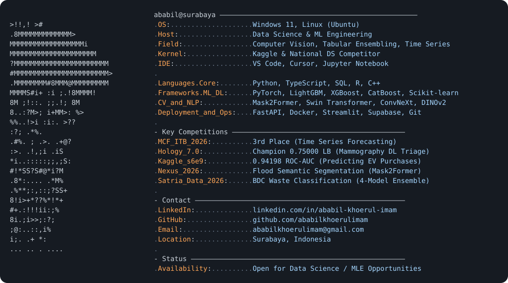

  <picture>
    <source media="(prefers-color-scheme: dark)" srcset="./dark_mode.svg">
    <source media="(prefers-color-scheme: light)" srcset="./light_mode.svg">
    
  </picture>

 

### 🏆 Competition Highlights & Benchmarks

| Competition / Benchmark | Problem Domain | Architecture / Method | Metric / Result | Repository |
| :--- | :--- | :--- | :--- | :--- |
| **MCF ITB 2026** | Spatio-Temporal Forecasting | Residual LightGBM Stacking, Deep Feature Engineering | **3rd Place National** | [`insurance-claim-forecasting-mcfitb26`](https://github.com/ababilkhoerulimam/insurance-claim-forecasting-mcfitb26) |
| **Hology 7.0** | Medical Mammography Triage | 7-Model Heterogeneous Ensemble (Swin, ConvNeXt, ResNet) + GeM & 8-pass TTA | **0.75000 Kaggle Public LB** | [`breast-cancer-classification`](https://github.com/ababilkhoerulimam/breast-cancer-classification) |
| **Kaggle s6e9** | EV Adoption Prediction | 46 Leakage-Safe Features, 5-Fold Stratified CV, Multi-Model Stacking | **0.94198 ROC-AUC** | [`predicting-electric-vehicle-purchases`](https://github.com/ababilkhoerulimam/predicting-electric-vehicle-purchases) |
| **Nexus 2026** | Multi-Class Flood Segmentation | Swin-Tiny Mask2Former across 10 classes, Lovasz-Softmax compound loss | High-Precision Segmentation | [`flood-segmentation-mask2former-nexus2026`](https://github.com/ababilkhoerulimam/flood-segmentation-mask2former-nexus2026) |
| **Satria Data 2026 (BDC)** | Waste Material Classification | 4-Model Ensemble (ConvNeXt V2, DINOv2, EVA-02, SigLIP) + Nelder-Mead OOF | Top-Tier Classification | [`multimodel-waste-classification-satriadata2026`](https://github.com/ababilkhoerulimam/multimodel-waste-classification-satriadata2026) |
| **SSDS UNS 2026** | Bengawan Solo River Hydro | Spatio-Temporal Water Level (TMA) Forecasting via HydroRIVERS & NNLS Stacking | Minimized Multi-Station RMSE | [`st-hydro-bengawansolo-ssfuns2026`](https://github.com/ababilkhoerulimam/st-hydro-bengawansolo-ssfuns2026) |

---

### 🚀 Production & Business Analytics

- **[BRIDGE Intelligence](https://github.com/ababilkhoerulimam/bridge-landing-page)**: Offline-first production intelligence platform for building material SMEs. Sub-2-minute shop floor logging, automated cloud sync, real-time OEE telemetry, and AI recipe optimization reducing material waste by 8–12%.
- **[SKU Variant & Cannibalization Analysis](https://github.com/ababilkhoerulimam/sku-variant-analysis)**: End-to-end Pareto analysis, duplicate reconciliation, sensitivity modeling, and Herfindahl-Hirschman Index (HHI) variant de-concentration.
- **[Credit Default Risk Engine](https://github.com/ababilkhoerulimam/credit-risk-prediction)**: Production-ready credit risk scoring combining leverage engineering, GBDT, and PyTorch MLP architectures.

---

